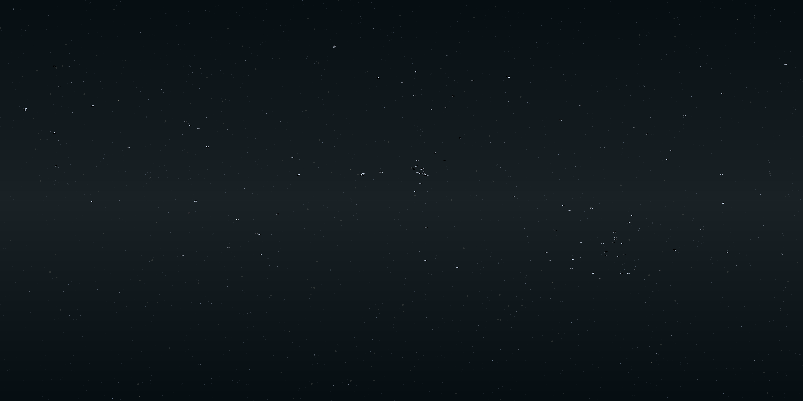

# Messier Deep Sky Navigator 🌌

## Hackathon Project Overview

An interactive deep sky object visualization platform that brings Charles Messier's famous catalog to life through modern web technologies. Built during NASA Space Apps Challenge 2025, this project combines astronomical data with cutting-edge web visualization techniques to create an engaging educational tool.

### Quick Demo: http://localhost:8000 (when running locally)



This 24-72 hour hackathon project visualizes all 110 Messier objects on an interactive, zoomable skymap using Leaflet for mapping and OpenSeadragon for deep-zoom DZI images.

## 🚀 Key Features

### Visualization
- **Interactive Sky Map**: Full equirectangular projection (8192×4096)
- **Deep Zoom Integration**: OpenSeadragon-powered detailed object viewing
- **Dynamic Tile System**: Efficient tile-based loading for smooth navigation
- **Futuristic UI**: Modern space operations inspired dashboard

### Data & Functionality
- **Complete Messier Catalog**: All 110 deep sky objects
- **Advanced Filtering**: Object type categorization
- **Search Capabilities**: Find objects by name or ID
- **Astronomical Data**: RA/Dec coordinates, magnitudes, and object types

## 🛠️ Technical Stack

### Frontend
- **Mapping**: Leaflet.js for sky visualization
- **Deep Zoom**: OpenSeadragon for detailed object viewing
- **Styling**: Modern CSS with custom components
- **Interactivity**: Vanilla JavaScript for performance

### Backend/Processing
- **Image Processing**: Python + PIL
- **Data Format**: JSON for catalog data
- **Tile Generation**: Custom Python scripts
- **Development Server**: Python's http.server

## 🚦 Quick Start

1. **Clone & Navigate**:
   ```bash
   git clone https://github.com/sanatK24/messier_catalog_nasa_space_challenge.git
   cd messier_catalog_nasa_space_challenge
   ```

2. **Start Local Server**:
   ```bash
   # Using Python 3
   python -m http.server 8000
   
   # OR using Node.js
   npx http-server -p 8000
   ```

3. **Access Application**:
   - Open http://localhost:8000 in your browser
   - Ensure local file fetching is enabled
   - Modern browser required for best experience

## 📁 Project Structure

```
/
├── index.html           # Main application interface
├── css/
│   ├── styles.css      # Core styles
│   └── components.css   # UI components
├── js/
│   └── app.js          # Application logic
├── messier_data.json   # Catalog data
├── messier_dzi/        # Deep zoom images
└── output/             # Generated assets
    └── tiles/          # Map tiles
```

## 🎯 Implementation Highlights

1. **Astronomical Accuracy**
   - Precise RA/Dec coordinate mapping
   - Accurate object positioning
   - Professional catalog data

2. **Performance Optimization**
   - Efficient tile loading
   - Dynamic image resolution
   - Smooth zoom transitions

3. **User Experience**
   - Intuitive navigation
   - Responsive design
   - Real-time filtering

## 🔄 Future Enhancements

1. **Visualization**
   - Toggle between historical/modern imagery
   - Constellation overlays
   - Real star catalog background
   - Multiple projection support

2. **Features**
   - Advanced filtering options
   - Shareable object links
   - Observation planning tools
   - Seasonal visibility calculator

3. **Data**
   - Additional catalogs
   - More astronomical data
   - Historical observations
   - Amateur viewing guides
## 🛠️ Technical Details

### DZI Image Processing

The project uses a custom DZI (Deep Zoom Image) converter that processes astronomical images for deep zoom viewing:

1. **Technology Stack**:
   - Python 3.8+
   - PIL (Python Imaging Library)
   - OpenSeadragon viewer

2. **Image Processing Pipeline**:
   ```python
   # Convert single image to DZI
   python image_to_dzi.py input.jpg [output_folder]
   
   # Batch convert entire catalog
   python batch_convert_to_dzi.py
   
   # Generate full skymap
   python stitch_messier_thumbs.py \
     --width 8192 \
     --height 4096 \
     --out output/messier_skymap_8k.png \
     --feather-radius 6 \
     --draw-labels \
     --generate-tiles \
     --max-zoom 6
   ```

3. **Key Features**:
   - Multi-resolution tile generation
   - Efficient image pyramids
   - Format support: JPEG, PNG, TIFF
   - Responsive web viewing

## 📊 Performance

### Image Processing
- DZI Conversion: ~30s per image
- Full Catalog Processing: ~1 hour
- Tile Generation: ~5 minutes
- Total Storage: ~2GB for full dataset

### Web Performance
- Initial Load: < 2s
- Tile Loading: < 200ms
- Memory Usage: < 100MB
- Browser Support: All modern browsers

## 🤝 Credits

- **Data Sources**:
  - Messier Catalog data
  - NASA/ESA imagery
  - Amateur astronomy contributions

- **Technologies**:
  - Leaflet.js - Map visualization
  - OpenSeadragon - Deep zoom viewing
  - Python - Image processing

## 🌟 Team

- **Sanat K** - Lead Developer
- *Add team members here*

## 📄 License

This project is licensed under the MIT License. See LICENSE file for details.

---

*Project developed for NASA Space Apps Challenge 2025*  
*Location: [Your Location]*  
*Team: [Your Team Name]*
