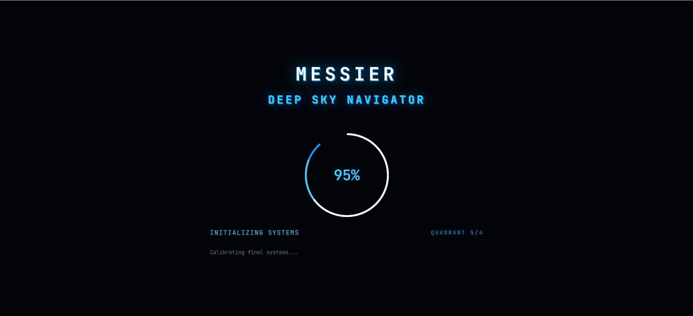
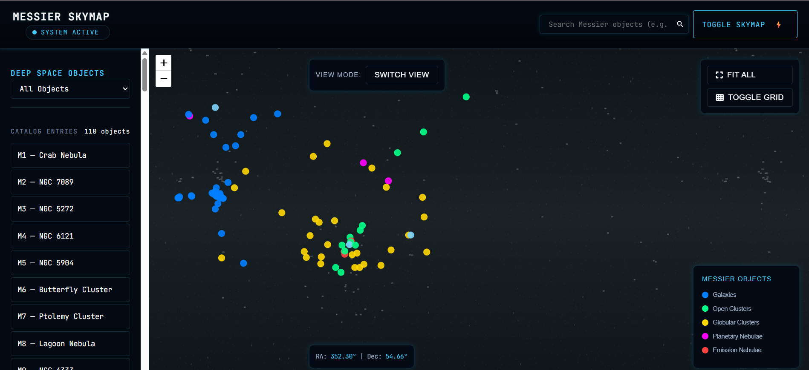
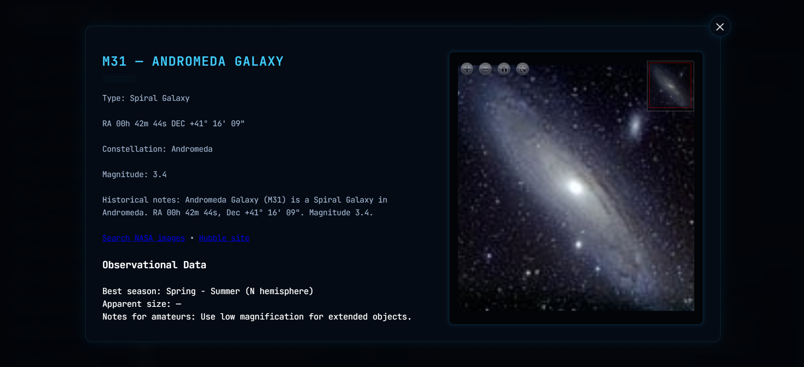

<h1 align="center">🌌 Messier Deep Sky Navigator</h1>

<p align="center">
  <em>Explore the cosmos — where code meets the stars.</em><br>
  <strong>NASA Space Apps Challenge 2025 · Team DataDrift</strong> 🚀
</p>

---

<div align="center">


</div>

---

## 🌠 Overview

**Messier Deep Sky Navigator** is an interactive web platform that brings Charles Messier’s deep-sky catalog to life.  
Built during the **NASA Space Apps Challenge 2025**, this project fuses **astronomy, design, and technology** to visualize galaxies, nebulae, and star clusters in stunning interactive clarity.

---

## 🚀 Quick Demo

**Local:** [http://localhost:8000](http://localhost:8000)  
**Live:** [https://messier-catalog-nasa-space-challeng.vercel.app/](https://messier-catalog-nasa-space-challeng.vercel.app/)

<div align="center">

<table>
  <tr>
    <td width="32%">
      
    </td>
    <td rowspan="2" width="68%">
      
    </td>
  </tr>
  <tr>
    <td width="32%">
      
    </td>
  </tr>
</table>

</div>

<p align="center">
  <em>“From Messier 1 to 110 — rediscover the universe, one object at a time.”</em>
</p>

---

## 🌌 Key Features

### 🛰 Visualization
- **Interactive Sky Map:** Equirectangular 8192×4096 projection  
- **Deep Zoom:** OpenSeadragon-powered DZI exploration  
- **Dynamic Tiling:** Smooth, efficient image loading  
- **UI Aesthetic:** Space-operations inspired dark theme  

### 🔭 Data & Functionality
- Complete **Messier Catalog (M1–M110)**  
- Object **search and filtering**  
- Accurate **RA/Dec mapping**  
- Real-time **data overlay system**

---

## 🛠️ Tech Stack

| Layer | Technologies |
|-------|---------------|
| **Frontend** | Leaflet.js · OpenSeadragon · Vanilla JS · Modern CSS |
| **Backend / Tools** | Python · PIL · JSON · Tile Generation Scripts |
| **Deployment** | Vercel · Localhost (Python or Node server) |

---

## ⚡ Quick Start

```bash
# Clone repository
git clone https://github.com/sanatK24/messier_catalog_nasa_space_challenge.git
cd messier_catalog_nasa_space_challenge

# Start local server
python -m http.server 8000
# or
npx http-server -p 8000
````

Then visit [http://localhost:8000](http://localhost:8000) ✨

---

## 📁 Project Structure

```plaintext
/
├── index.html
├── css/
│   ├── styles.css
│   └── components.css
├── js/
│   └── app.js
├── messier_data.json
├── messier_dzi/
└── output/
    └── tiles/
```

---

## 🌟 Implementation Highlights

* **Precision Mapping:** Astronomically accurate coordinates
* **Optimized Rendering:** Dynamic tiles for seamless zoom
* **Intuitive UI:** Responsive layout and galaxy-inspired design

---

## 🔮 Future Roadmap

* 🌌 Add constellation overlays & real star backgrounds
* 🪐 Introduce multi-projection sky modes
* 🛰 Observation planner and shareable sky view links
* 🔭 Integrate NGC and Caldwell catalogs

---

## ⚙️ DZI Image Processing

Custom Python scripts convert astronomical images into deep zoom tiles.

```bash
# Single image conversion
python image_to_dzi.py input.jpg output_folder

# Full catalog batch processing
python batch_convert_to_dzi.py
```

* Multi-resolution image pyramids
* Feathered edges for smooth stitching
* Supported formats: JPEG, PNG, TIFF

---

## 📊 Performance

| Metric          | Value                   |
| --------------- | ----------------------- |
| DZI Conversion  | ~30s/image              |
| Full Catalog    | ~1 hour                 |
| Tile Generation | ~5 minutes              |
| Web Load        | < 2s                    |
| Browser Support | Chrome · Firefox · Edge |

---

## 🪐 Credits

**Data Sources:** NASA / ESA · Messier Catalog · Open Astronomy Archives
**Technologies:** Leaflet.js · OpenSeadragon · Python PIL · CursorAI

---

## 👨‍🚀 Team — *DataDrift*

**Sanat Karkhanis**
🛠 Team Lead / UI & Visualization Architect
🔗 [GitHub](https://github.com/sanatkarkhanis) | 💼 [LinkedIn](https://linkedin.com/in/sanatkarkhanis) | 🌐 [Portfolio](https://sanatkarkhanisportfolio-cha8.vercel.app)

**Sarvesh Pingale**
🎨 Frontend Engineer / Design Systems
🔗 [GitHub](https://github.com/sarv-tech) | 💼 [LinkedIn](https://www.linkedin.com/in/sarvesh-pingale-8b9090299/)

**Sanjeta Singh**
🧠 Data Pipeline & Optimization
🔗 [GitHub](github.com/sanjeta-singh) | 💼 [LinkedIn](http://linkedin.com/in/sanjeta-singh)

**Abhishek Shelar**
📄 Documentation & Research Lead
🔗 [GitHub](https://github.com/Abhishelar1928) | 💼 [LinkedIn](https://www.linkedin.com/in/abhishek-shelar123/)

**Suraj Rout**
⚙️ Integration & Testing Engineer
🔗 [GitHub](https://github.com/DSDYRROTH) | 💼 [LinkedIn](https://www.linkedin.com/in/surajrout1)

---

## 📜 License

Licensed under the **MIT License**.
See the `LICENSE` file for more information.

---

<p align="center">
  <strong>✨ Project developed for NASA Space Apps Challenge 2025 ✨</strong><br>
  <em>“To explore the deep sky is to rediscover our place in the universe.”</em><br><br>
  
</p>
```
